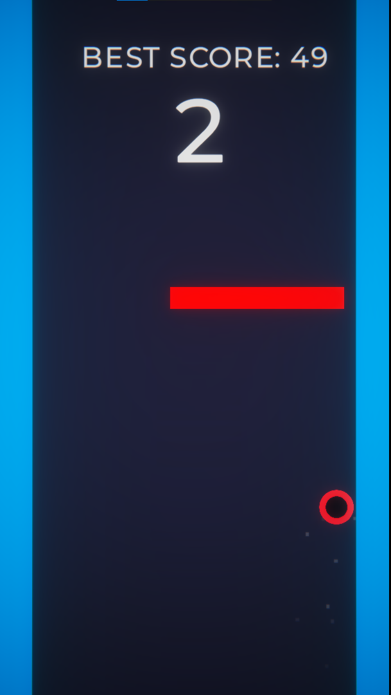
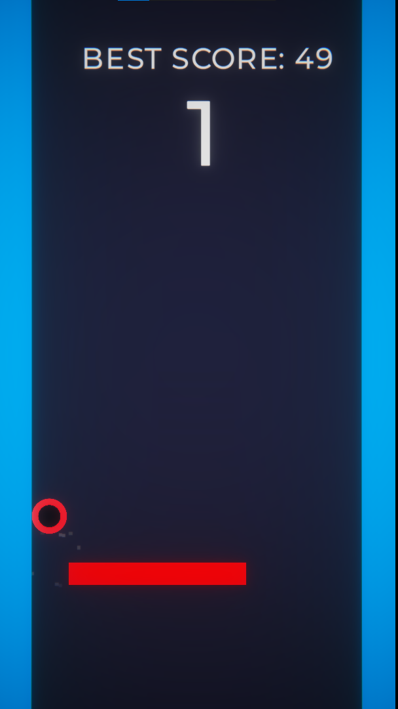
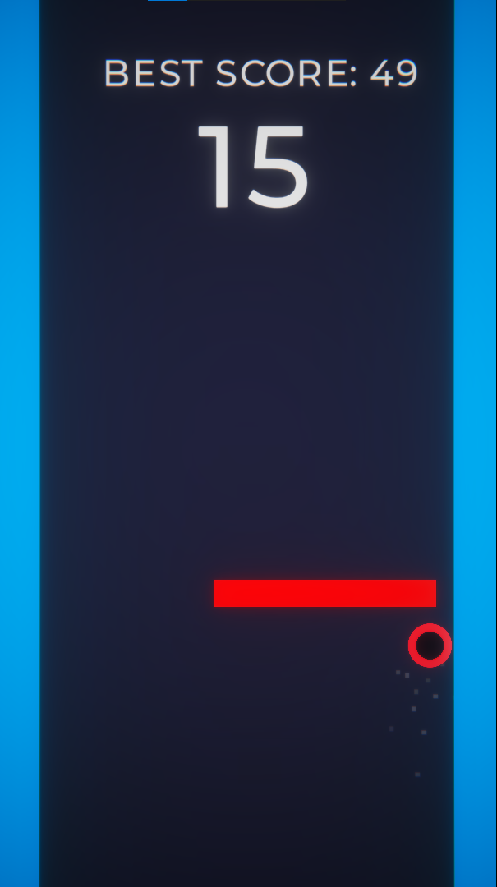
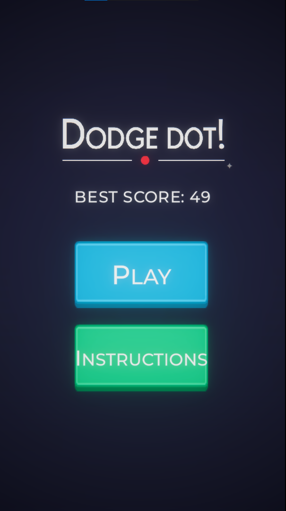
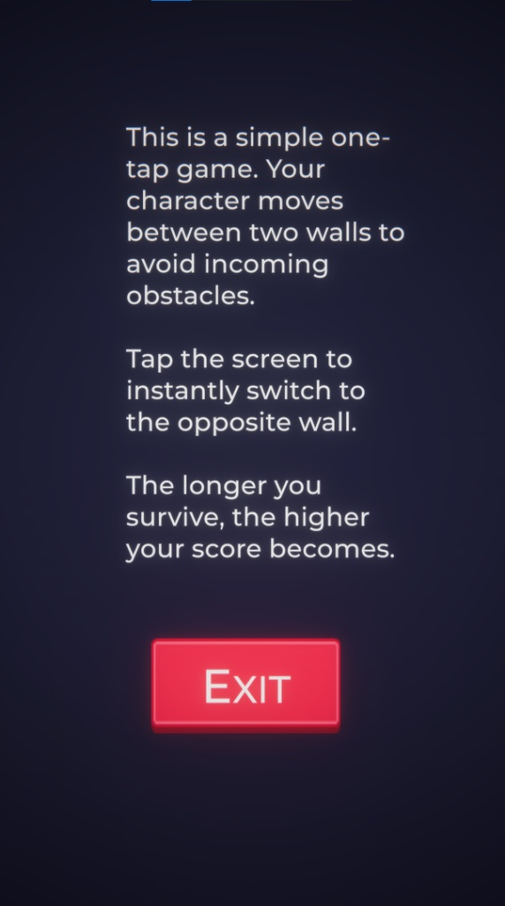

# 🎮 Dodge Dot!

**Dodge Dot!** is a fast-paced, hyper-casual 2D arcade game where your reaction time is everything.
Your goal is simple: survive as long as possible by dodging an endless stream of obstacles.

---

## 🕹️ Gameplay

* The player moves vertically between two walls
* Red platforms are deadly obstacles
* One click switches your position to the opposite wall
* The longer you survive, the higher your score

> Easy to learn, hard to master.

---

## 🎯 Controls

* 🖱️ Left Mouse Button / Tap — switch sides

---

## 📸 Screenshots

### 🎮 Gameplay

<p align="center">
  
  
  
</p>

### 📋 Menu & Instructions

<p align="center">
  
  
</p>

---

## 🚀 Play the Game

👉 [Play on itch.io](https://micode.itch.io/dodge-dot)

---

## 🛠️ Built With

* Unity (2D)
* C#

---

## 📂 Project Structure

```plaintext
Assets/
Packages/
ProjectSettings/
```

---

## 👨‍💻 Author

**Micode**

---

## ⭐ Support

If you like this project, consider giving it a ⭐ on GitHub!
